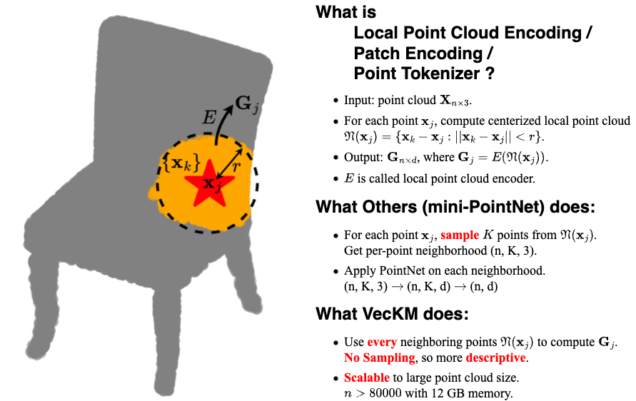
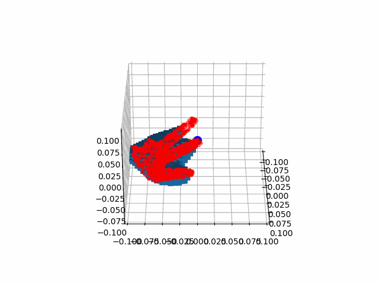
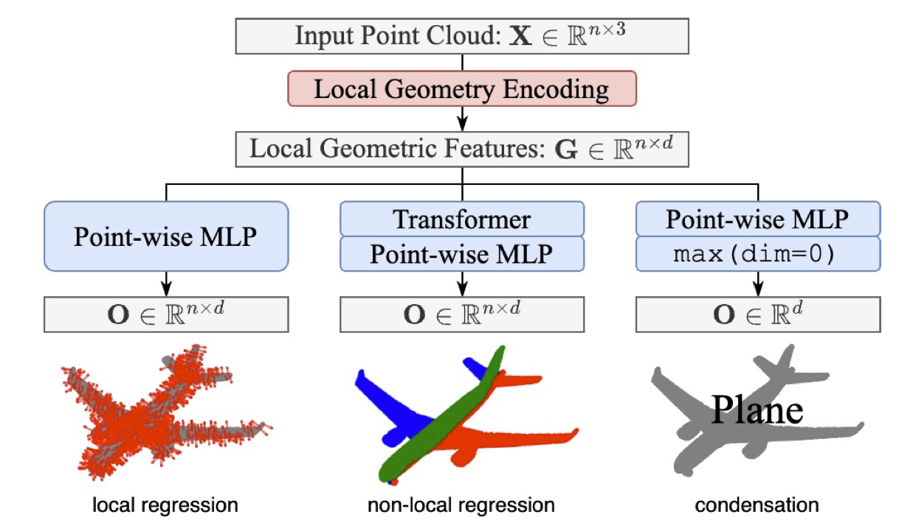
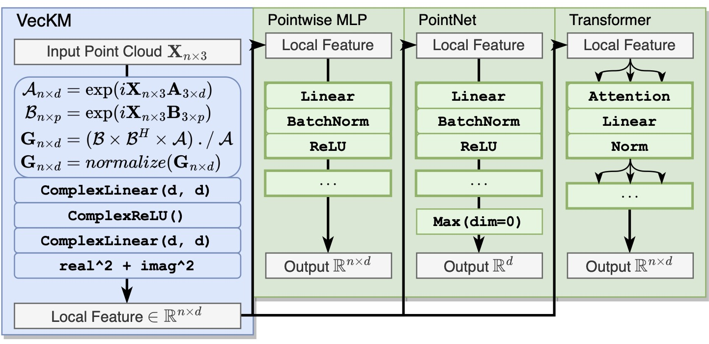

<h1 align='center' style="text-align:center; font-weight:bold; font-size:2.0em;letter-spacing:2.0px;"> VecKM: A Linear Time and Space Local Point Cloud Geometry Encoder </h1>

<p align='center' style="text-align:center;font-size:1.25em;">
    <a href="https://www.cs.umd.edu/~dhyuan" target="_blank" style="text-decoration: none;">Dehao Yuan</a>&nbsp;,&nbsp;
    <a href="http://users.umiacs.umd.edu/~fer/" target="_blank" style="text-decoration: none;">Cornelia Fermüller</a>&nbsp;,&nbsp;
    <a href="https://www.cs.umd.edu/people/trabbani" target="_blank" style="text-decoration: none;">Tahseen Rabbani</a>&nbsp;,&nbsp;
    <a href="https://furong-huang.com" target="_blank" style="text-decoration: none;">Furong Huang</a>&nbsp;,&nbsp;
    <a href="http://users.umiacs.umd.edu/~yiannis/" target="_blank" style="text-decoration: none;">Yiannis Aloimonos</a>&nbsp;&nbsp;
</p>

<p align='center';>
<b>
<em>ICML2024</em> &nbsp&nbsp&nbsp&nbsp <a href="http://arxiv.org/abs/2404.01568" target="_blank" style="text-decoration: none;">[Paper]</a>
</b>
<b>
&nbsp&nbsp&nbsp&nbsp <a href="https://www.youtube.com/watch?v=1i-_XRhK5VA" target="_blank" style="text-decoration: none;">[Video Talk]</a>
</b>
</p>

## News and Updates
* [Dec 8, 2024] We did an extension project of VecKM. We apply VecKM to event camera inputs and predict the motion field. Check out [VecKM_flow](https://www.github.com/dhyuan99/VecKM_flow).

## Highlighted Features


## API Usage
VecKM is a generic local point cloud encoder, a.k.a. point tokenizer, patch encoder, etc. The API is easily used by the following codes, after installing the package:
```
git clone https://github.com/dhyuan99/VecKM.git
cd VecKM

conda create -n VecKM python=3.13
conda activate VecKM

pip install --upgrade pip setuptools wheel
python setup.py sdist bdist_wheel
pip install .
```
See [demo](./demo) for the codes and data for running the demo: 
```
cd demo
python main.py
```

## API Documentation
We provide two implementations of VecKM: `ExactVecKM` and `FastVecKM`, corresponding to Eqn. (3) and Eqn. (2) in the paper. 
* `ExactVecKM` computes an accurate local point cloud encoding, in a slower manner. Suitable for tasks where accurate geometry is needed, e.g. normal estimation.
* `FastVecKM` computes a noisy local point cloud encoding with large point cloud inputs (e.g. size > 50000), in a faster manner. Suitable for tasks where only coarse geometry is needed, e.g. classification.

Both of them

* receive inputs with shape (n, 3) and output (n, d), operations defined at [Highlighted Features](#highlighted-features).
* scalable to point cloud size > 50000 and neighborhood size > 500 on 16GB memory.

The API call is as simple as followed, as shown in [./demo/main.py](demo/main.py):
``` python
from VecKM.encoder import ExactVecKM, FastVecKM

pts = torch.tensor(pts).float()
pts = pts.cuda()    # pts has shape (n, 3).

vkm = ExactVecKM(pt_dim=3, enc_dim=384, radius=0.1)
vkm = vkm.cuda()
G = vkm(pts)        # G has shape (n, 384).

vkm = FastVecKM(pt_dim=3, enc_dim=384, radius=0.1)
vkm = vkm.cuda()
G = vkm(pts)        # G has shape (n, 384).
```

## How to check the encoding quality?
`VecKM.visualize.check_vkm_quality_3d` provides a visual check of the encoding quality (Figure 5 in the paper). It will 

* visualize the local point cloud around `pts[which_pt]`, with radius specified in `vkm.radius`.
* visualize the reconstructed point cloud distribution from the VecKM encoding.

After executing the script
``` python
from VecKM.visualize import check_vkm_quality_3d
check_vkm_quality_3d(vkm, pts, which_pt=0)
```
It will generate a gif showing the 3d visualization. If the distribution aligns with the point cloud, it means the encoding quality is good. Check [./demo/main.py](demo/main.py) for more details.
<div align="center">

</div>

## Downstream Tasks
Local point cloud encoding is usually followed by point-wise regression, classification, regression, etc., as shown below.
<div align="center">

</div>



# Citation
If you find it helpful, please consider citing our papers:
```
@InProceedings{pmlr-v235-yuan24b,
  title = 	 {A Linear Time and Space Local Point Cloud Geometry Encoder via Vectorized Kernel Mixture ({V}ec{KM})},
  author =       {Yuan, Dehao and Fermuller, Cornelia and Rabbani, Tahseen and Huang, Furong and Aloimonos, Yiannis},
  booktitle = 	 {Proceedings of the 41st International Conference on Machine Learning},
  pages = 	 {57871--57886},
  year = 	 {2024},
  editor = 	 {Salakhutdinov, Ruslan and Kolter, Zico and Heller, Katherine and Weller, Adrian and Oliver, Nuria and Scarlett, Jonathan and Berkenkamp, Felix},
  volume = 	 {235},
  series = 	 {Proceedings of Machine Learning Research},
  month = 	 {21--27 Jul},
  publisher =    {PMLR},
  pdf = 	 {https://raw.githubusercontent.com/mlresearch/v235/main/assets/yuan24b/yuan24b.pdf},
  url = 	 {https://proceedings.mlr.press/v235/yuan24b.html},
}
```
