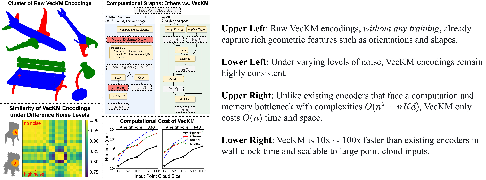
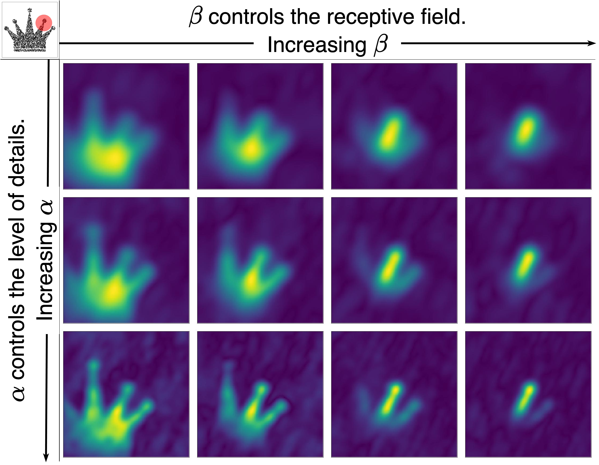

<h1 align='center' style="text-align:center; font-weight:bold; font-size:2.0em;letter-spacing:2.0px;"> VecKM: A Linear Time and Space Local Point Cloud Geometry Encoder </h1>

<p align='center' style="text-align:center;font-size:1.25em;">
    <a href="https://www.cs.umd.edu/~dhyuan" target="_blank" style="text-decoration: none;">Dehao Yuan</a>&nbsp;,&nbsp;
    <a href="http://users.umiacs.umd.edu/~fer/" target="_blank" style="text-decoration: none;">Cornelia Fermüller</a>&nbsp;,&nbsp;
    <a href="https://www.cs.umd.edu/people/trabbani" target="_blank" style="text-decoration: none;">Tahseen Rabbani</a>&nbsp;,&nbsp;
    <a href="https://furong-huang.com" target="_blank" style="text-decoration: none;">Furong Huang</a>&nbsp;,&nbsp;
    <a href="http://users.umiacs.umd.edu/~yiannis/" target="_blank" style="text-decoration: none;">Yiannis Aloimonos</a>&nbsp;&nbsp;
</p>

<p align='center';>
<b>
<em>arXiv-Preprint, 2024</em> &nbsp&nbsp&nbsp&nbsp <a href="http://arxiv.org/abs/2404.01568" target="_blank" style="text-decoration: none;">[arXiv]</a>
</b>
</p>

## Highlighted Features


## Usage

ℹ️ This section is illustrated with an [examples/example.ipynb](examples/example.ipynb).

⚠️ VecKM is sensitive to scaling. Please make sure to **scale your data so that your local point cloud lies within a UNIT BALL with radius 1.**

⚠️ For example, if you have a point cloud `pts` and you want to consider the local geometry with radius 0.1. Then you will do `pts *= 10` so that now you are considering the local geometry with radius 1.

⚠️ If your x, y, z do not have the same scale, make sure scaling them so that they have the same scale.

⚠️ VecKM is not rotational invariant. If the local point cloud is rotated, the encoding can be very different.

It is very simple to implement VecKM if you want to incorporate it into your own code. Suppose your input point cloud `pts` has shape `(n,3)` or `(b,n,3)`, then the following code will give you the VecKM local geometry encoding with output shape `(n,d)` or `(b,n,d)`. It is recommended to have PyTorch >= 1.13.0 since it has better support for complex tensors, but lower versions shall also work.

```
pip install scipy
pip install complexPyTorch
```

``` python
import torch
import torch.nn as nn
import numpy as np
from scipy.stats import norm

def strict_standard_normal(d):
    # this function generate very similar outcomes as torch.randn(d)
    # but the numbers are strictly standard normal, no randomness.
    y = np.linspace(0, 1, d+2)
    x = norm.ppf(y)[1:-1]
    np.random.shuffle(x)
    x = torch.tensor(x).float()
    return x

class VecKM(nn.Module):
    def __init__(self, d=256, alpha=6, beta=1.8, p=4096):
        """ I tested empirically, here are some general suggestions for selecting parameters d and p:
        (alpha=6, beta=1.8) works for the data scale that your neighbordhood radius = 1.
        Please ensure your point cloud is appropriately scaled!
        d = 256, p = 4096 is for point cloud size ~20k. Runtime is about 28ms.
        d = 128, p = 8192 is for point cloud size ~50k. Runtime is about 76ms.
        For larger point cloud size, please enlarge p, but if that costs too much, please reduce d.
        A general empirical phenomenon is (d*p) is postively correlated with the encoding quality.

        For the selection of parameter alpha and beta, please see the github section below.
        """
        super().__init__()
        self.alpha, self.beta, self.d, self.p = alpha, beta, d, p
        self.sqrt_d = d ** 0.5

        self.A = torch.stack(
            [strict_standard_normal(d) for _ in range(3)], 
            dim=0
        ) * alpha
        self.A = nn.Parameter(self.A, False)                                    # (3, d)

        self.B = torch.stack(
            [strict_standard_normal(p) for _ in range(3)], 
            dim=0
        ) * beta
        self.B = nn.Parameter(self.B, False)                                    # (3, d)

    def forward(self, pts):
        """ Compute the dense local geometry encodings of the given point cloud.
        Args:
            pts: (bs, n, 3) or (n, 3) tensor, the input point cloud.

        Returns:
            G: (bs, n, d) or (n, d) tensor
               the dense local geometry encodings. 
               note: it is complex valued. 
        """
        pA = pts @ self.A                                                       # Real(..., n, d)
        pB = pts @ self.B                                                       # Real(..., n, p)
        eA = torch.concatenate((torch.cos(pA), torch.sin(pA)), dim=-1)          # Real(..., n, 2d)
        eB = torch.concatenate((torch.cos(pB), torch.sin(pB)), dim=-1)          # Real(..., n, 2p)
        G = torch.matmul(
            eB,                                                                 # Real(..., n, 2p)
            eB.transpose(-1,-2) @ eA                                            # Real(..., 2p, 2d)
        )                                                                       # Real(..., n, 2d)
        G = torch.complex(
            G[..., :self.d], G[..., self.d:]
        ) / torch.complex(
            eA[..., :self.d], eA[..., self.d:]
        )                                                                       # Complex(..., n, d)
        G = G / torch.norm(G, dim=-1, keepdim=True) * self.sqrt_d
        return G

vkm = VecKM()
pts = torch.rand((10,1000,3))
print(vkm(pts).shape) # it will be Complex(10,1000,256)
pts = torch.rand((1000,3))
print(vkm(pts).shape) # it will be Complex(1000, 256)

from complexPyTorch.complexLayers import ComplexLinear, ComplexReLU
# You may want to use apply two-layer feature transform to the encoding.
feat_trans = nn.Sequential(
    ComplexLinear(256, 128),
    ComplexReLU(),
    ComplexLinear(128, 128)
)
G = feat_trans(vkm(pts))
G = G.real**2 + G.imag**2 # it will be Real(10, 1000, 128) or Real(1000, 1024).
```

ℹ️ See **[Suggestion for Tuning $\alpha$, $\beta$]** for how to tune `alpha` and `beta` parameters.

ℹ️ See **[Suggestion for Tuning $d$, $p$]** for how to tune `d` and `p` parameters.

ℹ️ **Feel free to contact me if you are unsure! I will try to respond within 1 day.**

## Suggestions for picking $\alpha$ and $\beta$
There are two parameters `alpha` and `beta` in the VecKM encoding. They are controlling the **resolution** and **receptive field** of VecKM, respectively. A higher `alpha` will produce a more detailed encoding of the local geometry, and a smaller `alpha` will produce a more abstract encoding. A higher `beta` will result in a smaller receptive field. You could look at the figure below for a rough understanding.



* You can slightly increase `alpha` if you have a relatively dense point cloud and want high-frequency details.
* You can slightly decrease `alpha` if you want to smooth out the high-frequency details and only keep the low-frequency components.
* For `beta`, it is closely related to the neighborhood radius. We provide a table of the correspondence. For example, if you want to extract the local geometry encoding with radius 0.3, then you would select beta to be 6.

<table>
<thead>
  <tr>
    <td>beta</td>
    <td>1</td>
    <td>2</td>
    <td>3</td>
    <td>4</td>
    <td>5</td>
    <td>6</td>
    <td>7</td>
    <td>8</td>
    <td>9</td>
    <td>10</td>
  </tr>
</thead>
<tbody>
  <tr>
    <td>radius</td>
    <td>1.800</td>
    <td>0.900</td>
    <td>0.600</td>
    <td>0.450</td>
    <td>0.360</td>
    <td>0.300</td>
    <td>0.257</td>
    <td>0.225</td>
    <td>0.200</td>
    <td>0.180</td>
  </tr>
  <tr>
    <td></td>
    <td></td>
    <td></td>
    <td></td>
    <td></td>
    <td></td>
    <td></td>
    <td></td>
    <td></td>
    <td></td>
    <td></td>
  </tr>
  <tr>
    <td>beta</td>
    <td>11</td>
    <td>12</td>
    <td>13</td>
    <td>14</td>
    <td>15</td>
    <td>16</td>
    <td>17</td>
    <td>18</td>
    <td>19</td>
    <td>20</td>
  </tr>
  <tr>
    <td>radius</td>
    <td>0.163</td>
    <td>0.150</td>
    <td>0.138</td>
    <td>0.129</td>
    <td>0.120</td>
    <td>0.113</td>
    <td>0.106</td>
    <td>0.100</td>
    <td>0.095</td>
    <td>0.090</td>
  </tr>
  <tr>
    <td></td>
    <td></td>
    <td></td>
    <td></td>
    <td></td>
    <td></td>
    <td></td>
    <td></td>
    <td></td>
    <td></td>
    <td></td>
  </tr>
  <tr>
    <td>beta</td>
    <td>21</td>
    <td>22</td>
    <td>23</td>
    <td>24</td>
    <td>25</td>
    <td>26</td>
    <td>27</td>
    <td>28</td>
    <td>29</td>
    <td>30</td>
  </tr>
  <tr>
    <td>radius</td>
    <td>0.086</td>
    <td>0.082</td>
    <td>0.078</td>
    <td>0.075</td>
    <td>0.072</td>
    <td>0.069</td>
    <td>0.067</td>
    <td>0.065</td>
    <td>0.062</td>
    <td>0.060</td>
  </tr>
</tbody>
</table>

## Suggestion for picking $d$ and $p$
We find empirically $d\times p$ is strongly correlated to the encoding quality. Here are several tips:
* A larger local neighborhood requires a larger $d$.
* A larger point cloud size requires a larger $p$.

Several examples:
* d = 256, p = 4096 is for point cloud size ~100k. Runtime is about 80ms.

## Experiments
Check out the applications of VecKM to [normal estimation](experiments/normal_estimation), [classification](experiments/classification), [part segmentation](experiments/part_segmentation). The overall architecture change will be like:


# Citation
If you find it helpful, please consider citing our papers:
```
@misc{yuan2024linear,
      title={A Linear Time and Space Local Point Cloud Geometry Encoder via Vectorized Kernel Mixture (VecKM)}, 
      author={Dehao Yuan and Cornelia Fermüller and Tahseen Rabbani and Furong Huang and Yiannis Aloimonos},
      year={2024},
      eprint={2404.01568},
      archivePrefix={arXiv},
      primaryClass={cs.CV}
}
```
