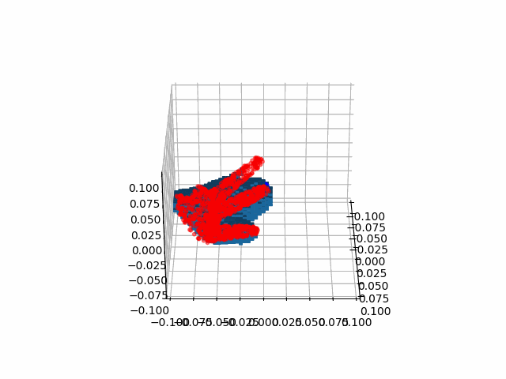

We provide an example of using both `ExactVecKM` and `FastVecKM` to compute the per-point local point cloud encoding, given a `(100000,3)` point cloud:
```
python main.py
```
It shows how the API is used, and how to check the encoding quality with the visualization tool. The command outputs are as followed:

```
The shape of pts is (n, 3): (100000, 3)
Preprocessing the data... Normalize the points into a unit ball.
[[ 0.00622046  0.62610329  0.07458451]
 [-0.06785286 -0.46164555  0.09950156]
 [ 0.0838672  -0.56487705 -0.12544057]
 ...
 [-0.07780755 -0.05594401  0.10040794]
 [ 0.11728748  0.19354883 -0.15473476]
 [-0.13075289  0.20784576  0.02455094]]
ExactVecKM: The shape of per-point local geometry encoding is (n, d): torch.Size([100000, 384])
FastVecKM: The shape of per-point local geometry encoding is (n, d): torch.Size([100000, 384])
Generating images...: 100%|██████████| 36/36 [00:17<00:00,  2.02it/s]
GIF saved at exact_vkm_quality_check.gif
Generating images...: 100%|██████████| 36/36 [00:17<00:00,  2.00it/s]
GIF saved at fast_vkm_quality_check.gif
```

The quality checking gif are generated as followed. **Left** is `ExactVecKM`, **Right** is `FastVecKM`.
<div align="center">


</div>
